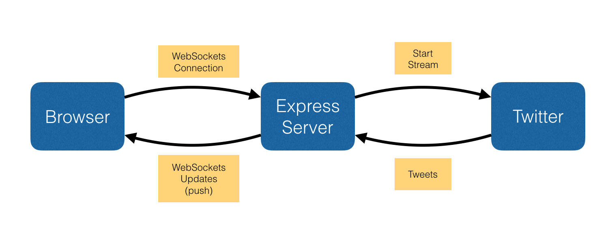

# Websockets with socket.io

### Objectives
*After this lesson, students will be able to:*

- Describe what realtime means, and how channels & open sockets push data to clients
- Set up websockets on the server side
- Use jQuery to update the client side

### Preparation
*Before this lesson, students should already be able to:*

- Create an Express app
- Write jQuery that updates the DOM

## Web basics recap - Intro (10 mins)

Typically a Web server is waiting for clients (browsers) to make requests. Once a request is received the server processes the request and send a response to the browser that initiated the request.

But what if the server has some new information that it wants to send the clients? How can the server notify the clients of the new data?

One strategy is that each client can _poll_ the server to see if it has any new data. There are two main types of polling:

1. Short polling (AJAX based timer):

```javascript
function doShortPoll(){
    $.post('ajax/test.html', function(data) {
        alert(data);  // process results here
        setTimeout(doPoll,5000);
    });
}
```

2. Long polling. This method opens connection with the server, and the server notifies the client(s) when new data is available:

```javascript
function doLongPoll(){
    $.ajax({ url: "server", success: function(data){
        //Update your dashboard gauge
        salesGauge.setValue(data.value);
    }, dataType: "json", complete: poll, timeout: 30000 });
}
```

Many different types of applications could use these polling techniques. For example, a chatroom in an app that helps you attain highly desirable concert tickets by polling a ticket distributor so you can be notified first when tickets are available.

## What are the issues with polling?

It's _slow_! Polling every `n` seconds isn't efficient, and if you poll too often, your bandwidth will go through the roof and slow down your server.

## Enter Websockets

_WebSockets_ solves this by maintaining an open connection between the Server and the Client(s) so that the server can _push_ information to the client instantly (as soon as the data is available). Think of it like push notifications on your phone. This _push_ functionality is made possible by the fact that a WebSocket is event-based, meaning a specific event can occur or be either generated (emitted) or received (listened for) by either the server or the client.

The concept behind these event emitters and event listeners is similar to the DOM event emitters/handlers you're familiar with, but instead of listening for an `onClick` to handle, you can be listening for a _message_ event coming from the server via a socket and handle it by putting it into the client's view (via a DOM update).

Unlike HTTP requests, once a connection is established with websockets, you don't get continuous meta data like types, user-agents, cookies, dates, etc.


## Code-Along - A Twitter Search App with Web Sockets

We are going to build a simple search app that connects to the Twitter Streaming API and pushes updates to the browser via WebSockets!



### Step 1 - Create the Project

```bash
mkdir twitter-search
cd twitter-search
express -e
```

### Step 2 - Install Libraries

```bash
npm install --save socket.io
npm install --save twit
bower install bootstrap
bower install seiyria-bootstrap-slider
cp bower_components/bootstrap/dist/css/bootstrap.min.css public/stylesheets
cp bower_components/bootstrap/dist/js/bootstrap.min.js public/javascripts
cp bower_components/jquery/dist/jquery.min.js public/javascripts
cp bower_components/seiyria-bootstrap-slider/dist/bootstrap-slider.min.js public/javascripts
cp bower_components/seiyria-bootstrap-slider/dist/css/bootstrap-slider.css public/stylesheets
cp node_modules/socket.io-client/socket.io.js public/javascripts
```

### Step 3 - Create CSS

Set the content of `public/stylesheets/style.css` to the following:

```css
body {
  background-color: #00aff0;
  color: #323332;
}

h1, h2, h3 {
  text-align: center;
  color: #fff;
  text-shadow: 0 0 2px #323332;
  line-height: 1;
  margin-bottom: 20px;
}

#slider {
  margin: 10px;
}

#sliderValue {
  color: white;
}

#tweet-container {
  /*
  max-height: 300px;
  overflow: auto;
  overflow-x: hidden;
  */
}

.tweet {
  margin: 5px 20px;
  padding: 5px;
  border: 1px solid rgba(50,51,50,0.5);
  margin-bottom: 10px;
  background-color: #fdfdfd;
  -webkit-border-radius: 3px;
  -moz-border-radius: 3px;
  border-radius: 3px;
  opacity: 0;
  transition:opacity 0.25s linear;
}

.tweet.fadeIn {
  opacity: 1;
}

.tweet.fadeOut {
  opacity: 0;
}

#slider .slider-selection {
  background: #BABABA;
}

.names, .contents {
  margin-left: 60px;
}

form {
  text-align: center;
  max-width: 320px;
  margin: 0 auto 20px;
}
```

### Step 4 - Set the Main HTML Content

Set the content of `views/index.ejs` to the following:

```html
<!DOCTYPE html>
<html>
  <head>
    <title>Welcome to the Twitter Stream</title>
    <link rel="stylesheet" type="text/css" href="/stylesheets/bootstrap.min.css">
    <link rel="stylesheet" type="text/css" href="/stylesheets/bootstrap-slider.css">
    <link rel='stylesheet' type="text/css" href='/stylesheets/style.css' />
  </head>
  <body>
    <div class="container-fluid">
      <h1>Welcome to the Twitter Stream</h1>
      <section class="row">
        <aside class="col-sm-4 text-center">
          <form class="form-inline" name="search">
            <div class="form-group">
              <label for="searchTerm">Term</label>
              <input type="text" class="form-control" id="searchTerm">
            </div>
            <button type="submit" class="btn btn-primary">Search</button>
          </form>
          <button id="toggle-button"
                  class="btn btn-warning text-center"
                  onclick="toggleStream()"></button>
          <br/>
          <br/>
          <label>Number of Tweets to Show</label>
          <input id="slider"
                 type="text"
                 data-slider-id='slider'
                 data-slider-min="1"
                 data-slider-max="20"
                 data-slider-step="1"
                 data-slider-value="10"/>
          <span id="sliderValue"></span>
        </aside>
        <main class="col-sm-8 text-center">
          <h3>Displaying Tweets for "<span id="search-term"></span>"
          <button id="clear-button"
                    class="btn btn-danger btn-sm"
                    onclick="clearTweets()">Clear</button></h3>
          <div id="tweet-container"></div>
        </main>
      </section>
    </div>
  </body>

  <script type="text/javascript" src="/javascripts/jquery.min.js" defer></script>
  <script type="text/javascript" src="/javascripts/bootstrap.min.js" defer></script>
  <script type="text/javascript" src="/javascripts/bootstrap-slider.min.js" defer></script>
  <script type="text/javascript" src="/javascripts/socket.io.js" defer></script>
  <script type="text/javascript" src="/javascripts/app.js" defer></script>

</html>
```

### Step 5 - Create the Server-Side WebSockets Connection and Twitter Stream API Connection

Create the file `config/socketio.js` and set the content to the following:

```javascript
module.exports = function(server) {

  // Setup SOCKET.IO Server
  var io = require('socket.io')(server);

  var Twit = require('twit');
  var twitter = new Twit({
    consumer_key: process.env.TWITTER_CONSUMER_KEY,
    consumer_secret: process.env.TWITTER_CONSUMER_SECRET,
    access_token: process.env.TWITTER_ACCESS_TOKEN,
    access_token_secret: process.env.TWITTER_ACCESS_TOKEN_SECRET
  });

  var stream;
  var searchTerm;

  io.on('connect', function(socket) {

    console.log('Socket IO is listening');

    socket.on('stopStream', function() {
      console.log('stopping Stream');
      if (stream) {
        stream.stop();
      }
    });

    socket.on('startStream', function() {
      console.log('starting Stream');
      if (stream) {
        stream.start();
      }
    });

    socket.on('updateTerm', function (searchTerm) {
      console.log('updateTerm:', searchTerm);
      socket.emit('updatedTerm', searchTerm);

      // Start stream
      if (stream) {
        stream.stop();
      }

      console.log('Connecting to twitter streaming api');
      stream = twitter.stream('statuses/filter', { track: searchTerm, language: 'en' });

      stream.on('tweet', function (tweet) {
        var data = {};
        data.name = tweet.user.name;
        data.screen_name = tweet.user.screen_name;
        data.text = tweet.text;
        data.user_profile_image = tweet.user.profile_image_url;
        socket.emit('tweets', data);
      });
    });
  });
};
```

### Step 6 - Load the Server WebSocket Config

Edit the file `bin/www` and add the code marked below:

```javascript
/**
 * Create HTTP server.
 */

var server = http.createServer(app);

// START OF NEW CODE TO ADD
// configure SocketIO
var server = http.Server(app);
require('../config/socketio.js')(server);
// END OF NEW CODE TO ADD
```

### Step 7 - Get Twitter API Keys for your App

Head to apps.twitter.com and set up your application
Then add your keys to a BASH script that you can source:

```bash
touch set-keys.bash
```

The contents of `set-keys.bash` should be similar to below:

```bash
export TWITTER_CONSUMER_KEY=''
export TWITTER_CONSUMER_SECRET=''
export TWITTER_ACCESS_TOKEN=''
export TWITTER_ACCESS_TOKEN_SECRET=''
```

You will need to put your Twitter API keys into `set-keys.bash`.

> IMPORTANT: You should add `set-keys.bash` to your .gitignore file as you should __NEVER SHARE YOUR API KEYS__!!!

You will need to _source_ the `set-keys.bash` file to set your Twitter API key environment variables:

```bash
. set-keys.bash
```

### Step 8 - Create the Client-Side JavaScript Code

We need some client-side JavaScript to do the following:

* Create a WebSocket connection with the server
* Listen for specific WebSocket messages (events)
* Update the DOM when receiving an interesting WebSocket event

Create the file `public/javascripts/app.js` and set the content to the following:

```javascript
let socket = io();
let mode = 'stopped';

function toggleStream() {
  if (mode === 'started') {
    socket.emit('stopStream');
    mode = 'stopped';
    $('#toggle-button').text('Start Streaming');
  }
  else {
    socket.emit('startStream');
    mode = 'started';
    $('#toggle-button').text('Stop Streaming');
  }
}

function clearTweets() {
  $tweetContainer.empty();
}

$(function () {

  $('#toggle-button').hide();
  $tweetContainer = $('#tweet-container');

  let $slider = $('#slider').slider({
    formatter: function(value) {
      // return 'Current value: ' + value;
      return value;
    }
  });

  $('#slider').on("slide", function(e) {
    $("#sliderValue").text(e.value);
  });

  $("#sliderValue").text($slider.slider('getValue'));

  socket.on('connect', function() {
    console.log('Connected!');
  });

  socket.on('tweets', function(tweet) {
    let $tweetHtml = $(`
    <div class="row">
      <div class="tweet">
        
        <div class="names">
          <span class="full-name">${tweet.name}</span>
          <span class="username">@${tweet.screen_name}</span>
        </div>
        <div class="contents">
          <span class="text">${tweet.text}</span>
        </div>
      </div>
    </div>`);

    $tweetContainer.prepend($tweetHtml);
    setTimeout(function() {
      $tweetHtml.children('.tweet').first().addClass('fadeIn');
    }, 50);

    // limit to the last N tweets
    let sliderValue = $slider.slider('getValue');
    if ($tweetContainer.children().length > sliderValue) {
      let childrenToRemove = $tweetContainer.children(':gt(' + (sliderValue-1) + ')');
      // console.log('removing %s children', childrenToRemove.length);
      childrenToRemove.children('.tweet').removeClass('fadeIn').addClass('fadeOut');
      setTimeout(function() {
        childrenToRemove.remove();
      }, 250);
    }
  });

  $('form').on('submit', function() {
    event.preventDefault();
    let search_term = $('input').val();
    socket.emit('updateTerm', search_term);
    mode = 'started';
    $('#toggle-button').text('Stop Streaming').show();
  });

  socket.on('updatedTerm', function(searchTerm) {
    $('#search-term').text(searchTerm);
    clearTweets();
  });
});
```

### Step 9 - Test it out

```bash
npm start
```

## Resources

* [socket.io](http://socket.io)
* [twit](https://github.com/ttezel/twit)
* [Twitter](https://apps.twitter.com)
